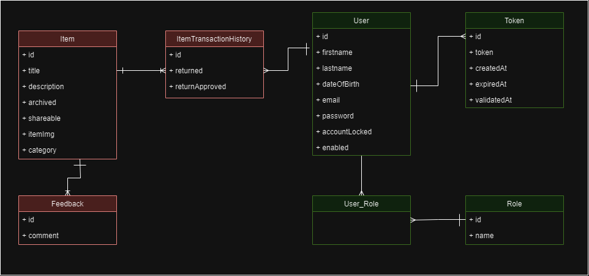
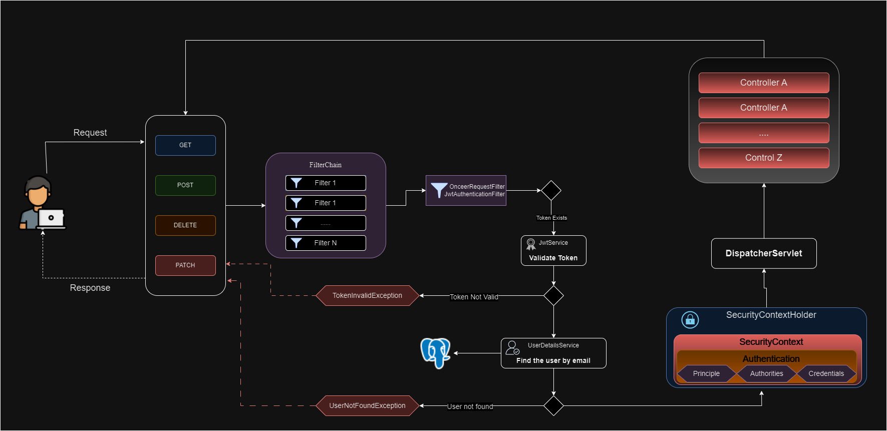
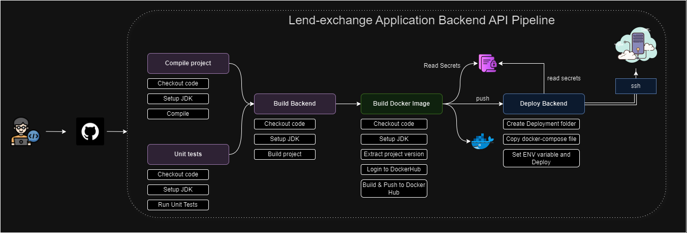
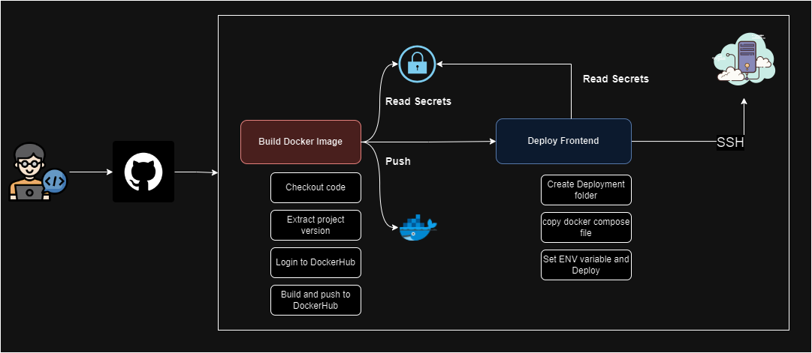

# lend-exchange Application

## Overview

Lend Exchange is a full-stack application that enables users to manage their products, items, collections and engage with a community. It offers features such as user registration, secure email validation, item management (including creation, updating, sharing, and archiving), item borrowing with checks for availability, item return functionality, and approval of item returns. The application ensures security using JWT tokens and adheres to best practices in REST API design. The backend is built with Spring Boot 3 and Spring Security 6, while the frontend is developed using Angular with Bootstrap for styling.

## Features

- User Registration: Users can create new accounts.
- Email Validation: Account activation via secure email validation codes.
- User Authentication: Secure login for existing users.
- Item Management: Create, update, share, and archive items.
- Item Borrowing: Checks implemented to determine item borrowability.
- Item Returning: Feature for users to return borrowed items.
- Item Return Approval: System to approve returned items.

## Technologies Used

### Backend (lend-exchange)

- Spring Boot 3
- Spring Security 6
- JWT Token Authentication
- Spring Data JPA
- JSR-303 and Spring Validation
- OpenAPI and Swagger UI Documentation
- Docker
- GitHub Actions
- Keycloak

### Frontend (lend-exchange-frontinterface)

- Angular
- Component-Based Architecture
- Lazy Loading
- Authentication Guard
- OpenAPI Generator for Angular
- Bootstrap

## Class Diagram

## Spring Security Diagram

## Backend pipeline

## Frontend Diagram

## Getting Started

To get started with the Book Social Network project, follow the setup instructions in the respective directories:

- [Backend Setup Instructions](lend-exchange/README.md)
- [Frontend Setup Instructions](lend-exchange-frontinterface/README.md)

## Contributors
* [Sesmith Tharuka - LinkedIn](https://www.linkedin.com/in/sesmiththaruka/)
* [Sesmith Tharuka - github](https://github.com/sesmiththaruka/)
